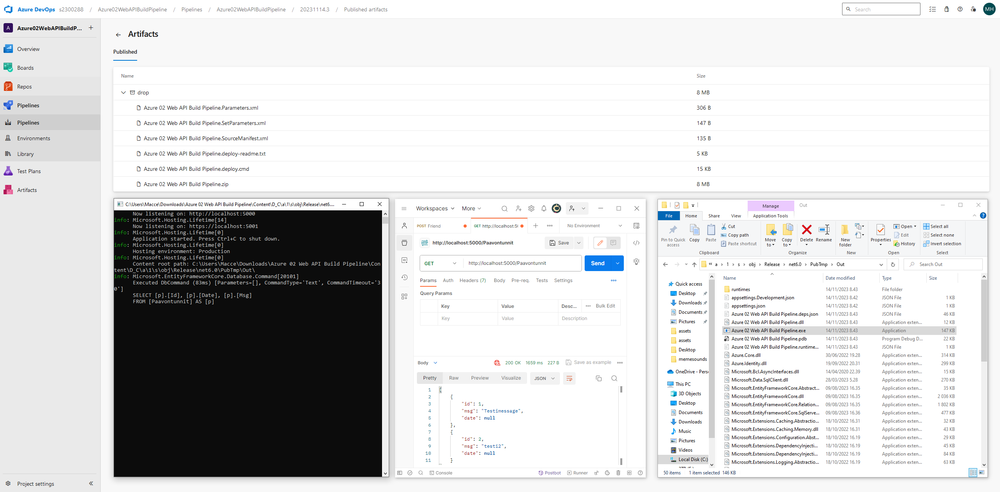

## WebApi with build pipeline

In this tutorial I created a build pipeline for WebApi. The goal was to modify the .yaml to generate artifact and test it in another environment.

The WebApi was built using Entity Framework and its tools. Database first!

